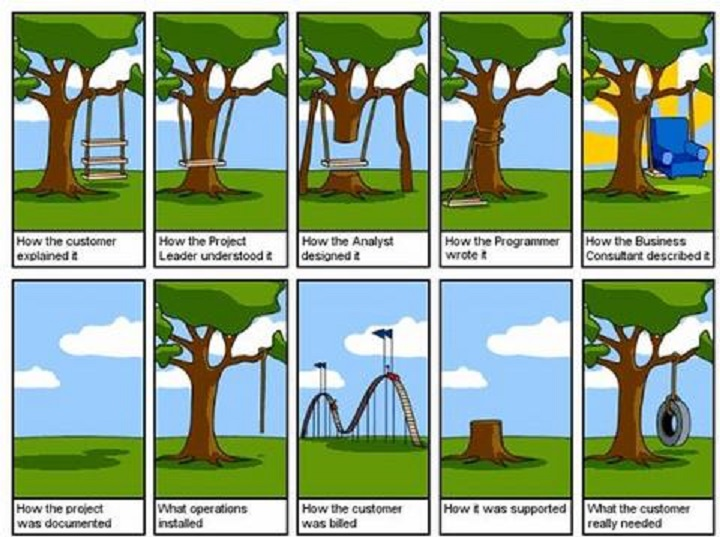

Configuration management is something I had not thought of for more than a moment prior to taking Software Engineering at UH Manoa.  I had never participated in a true group programming project or assignment, yet after learning of the necessities of configuration management in software development from our course's related [module](http://courses.ics.hawaii.edu/ics314f16/modules/configuration-management/), I understand that it simply must be known for anyone involved in a medium to large scale collaborative project.

## Git With The Program

*Hail Lord Octocat*

What the heck is Git, and who the heck is Lord Octocat?  Git is a leading [version control system](https://git-scm.com/book/en/v2/Getting-Started-About-Version-Control), and Lord Octocat (actually he's just named Octocat, I threw in the Lord for dramatic effect) is the mascot for [GitHub](https://github.com/), the leading hosting service for projects using Git.  I found this [Stack Overflow](http://stackoverflow.com/questions/13321556/difference-between-git-and-github) post to be a helpful quick explanation of what Git and GitHub are, in a nutshell.  My understanding of Git is that it works extremely efficiently in terms of speed, storage of collaborative projects, and workflow possibilities in comparison to other current version control systems, and thus is a clear winner.

## The Hub Is Where It's At

Is Git popular because of GitHub?  While I have admittedly little knowledge on the origins and related histories of Git and GitHub, I can't help but think that while GitHub is an amazing and very responsive resource for using Git, the system Git itself has so many marked advantages over other previously popular version control systems, that I imagine Git would have become prominent sooner than later.  In any case, technologies such as Git give development teams a better chance of avoiding something like this from happening:

