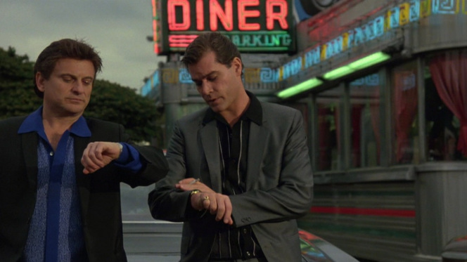

#### Semantics: the study of the meanings of words and phrases in language
  -[*merriam-webster.com*](http://www.merriam-webster.com/)

As an aspiring computer scientist who has very limited experience with web application development, let alone web app frameworks, the idea of [Meteor](https://www.meteor.com/) held strong appeal: a way to build professional grade web applications for both home computer and mobile devices, all with once language (JavaScript).  I had some exposure to Meteor in the past but never fully invested myself in it until recently, and I was excited to begin a journey towards making a cool web application with my own semi-unique idea behind it all.  Now?  Those dreams have been crushed, along with my soul.  Kidding, but I did indeed get a tough reality check upon realizing that while Meteor may be a faster, possibly better way than most for build a web app *full stack* (from the user interface/client side front end, to the server side back end), it's not a miracle of immediate ease of use and productivity.

I did feel at times like I was searching for a unicorn while trying to understand how the code worked in [some of the  Meteor tutorials](http://courses.ics.hawaii.edu/ics314f16/morea/meteor-1/experience-meteor-blaze-tutorial.html) I was exposed to.

## Easier To Read, But You Still Have To Read

*If only web design was this easy.*

Like other UI frameworks, Semantic UI is not a magic lamp that you can rub whenever you want something cool to appear on your webpage without knowing more than a lick about HTML and CSS.  You do need to have a general idea of how to use CSS  classes, common structures, etc.  And while using Semantic UI to make aesthetically pleasing web page elements such as clickable links and buttons is fairly straightforward, there is likely hours of new material/syntax to learn and understand before you can be up and running towards making a stylish site from top to bottom.

*It's taking a while, but it's gonna be a big score, trust me.*

This [very thorough introduction](http://courses.ics.hawaii.edu/ics314f16/morea/ui-frameworks/experience-semantic-ui-pluralsight.html) is a strong resource to seemingly all of the primary constructs of Semantic UI.  It can though, be difficult to take in and retain so much information at once, and it will take a fair number of hours to get through all of that material and absorb a good deal of it.  If you stay the course and combine this resource with [code examples from the Semantic UI website](http://semantic-ui.com/elements/button.html) (info and code demos for the element "Button" is linked here as an example), you will be well equipped to use Semantic UI to tackle a web design project, and make it look pretty slick!

One aspect of Semantic UI's class system that I really like is the ability to add "filler words" to the existing class names to create custom styles for certain elements on your webpage.  For example, if you are creating a new Semantic UI menu, you can add any word before the "menu" in class *ui menu* (say you call it *ui my menu* instead of *ui menu*), and on your CSS style page, you can create custom stylings for that *.ui.my.menu* class while retaining the same functionality of the Semantic UI menu class.

## Catchy, and Catching On

So Semantic UI is pretty cool to use, and lets you make cool looking stuff with just a moderate initial time investment, but is anyone actually using it to make popular web sites?  It turns out that [Snapchat](https://www.snapchat.com/) uses Semantic, and while not the prettiest example, there are many others ([here](https://chotheme.com/), and [here](https://caddyserver.com/) are some nice ones) that demonstrate attractive and unique web designs through use of the Semantic UI framework.  Thus far, my brief experience with Semantic UI has been eye-opening, and it seems like a good bet to draw upon Semantic for any websites I might make in the near future.  At least until that magic lamp framework comes out.
