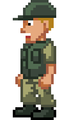
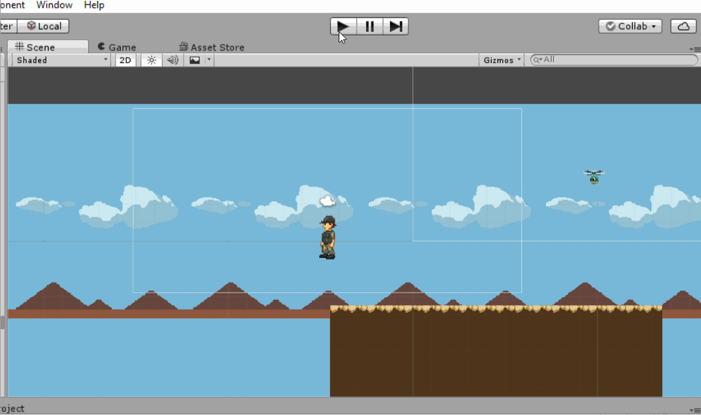
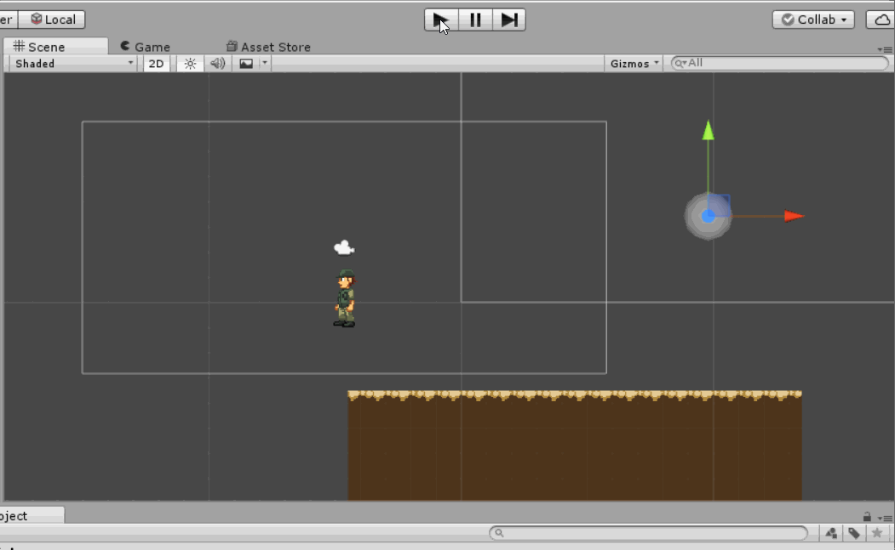
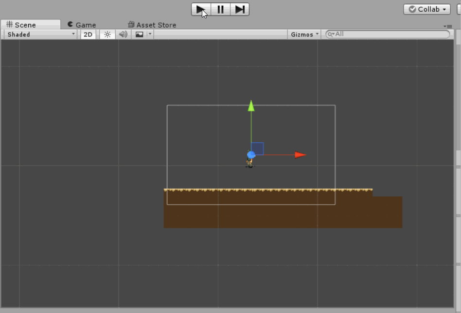
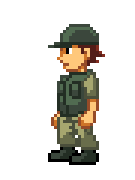
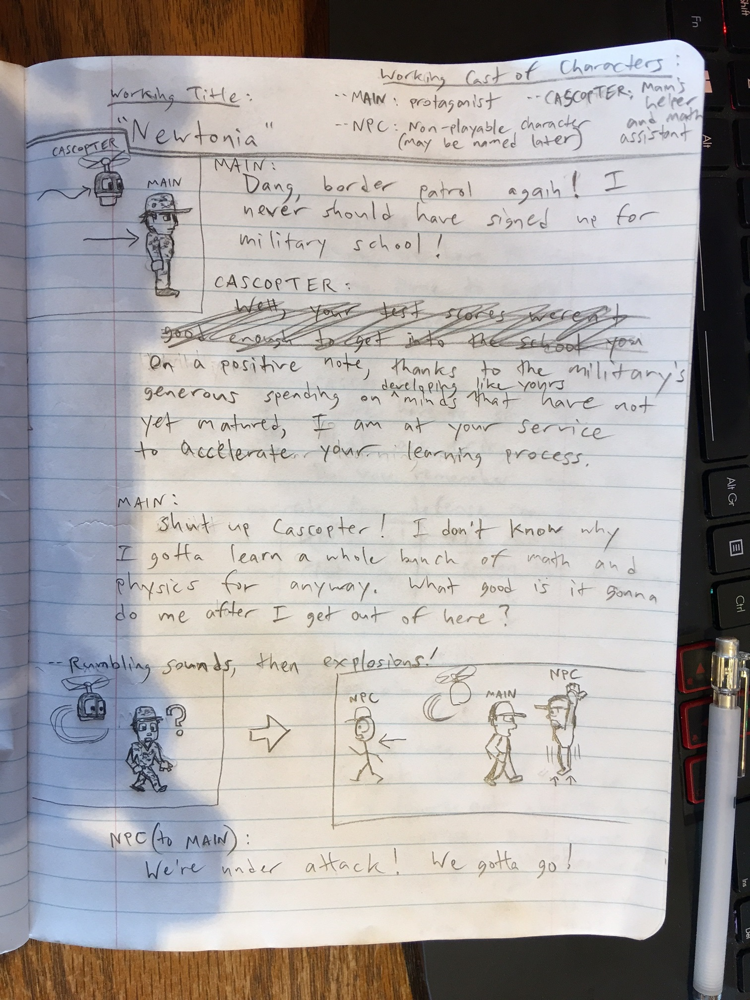
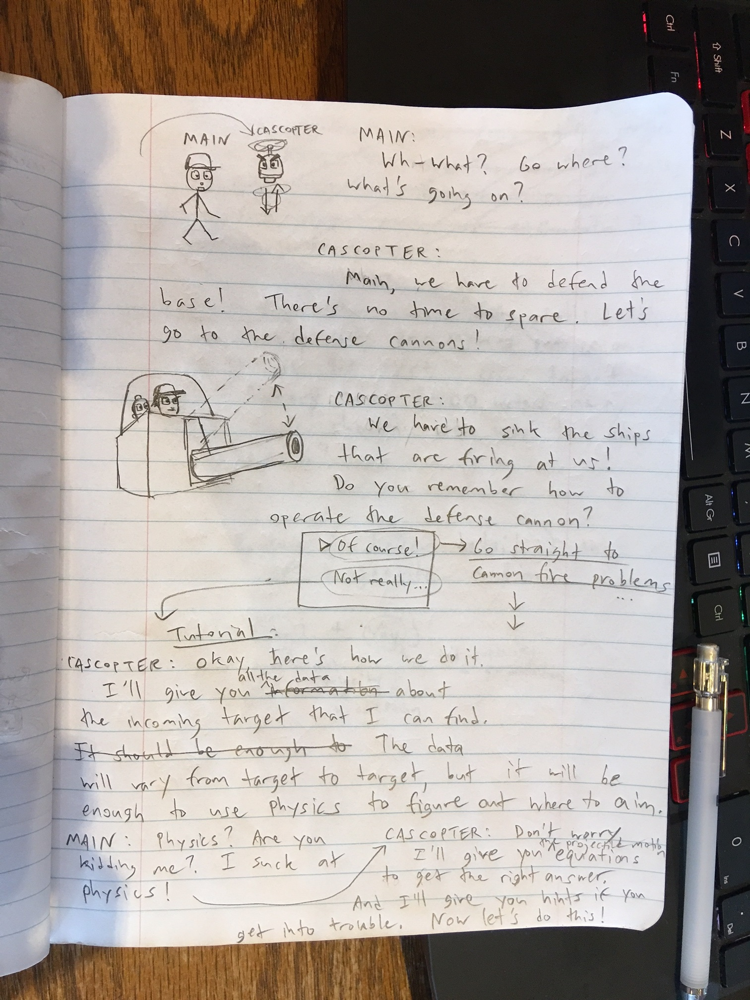
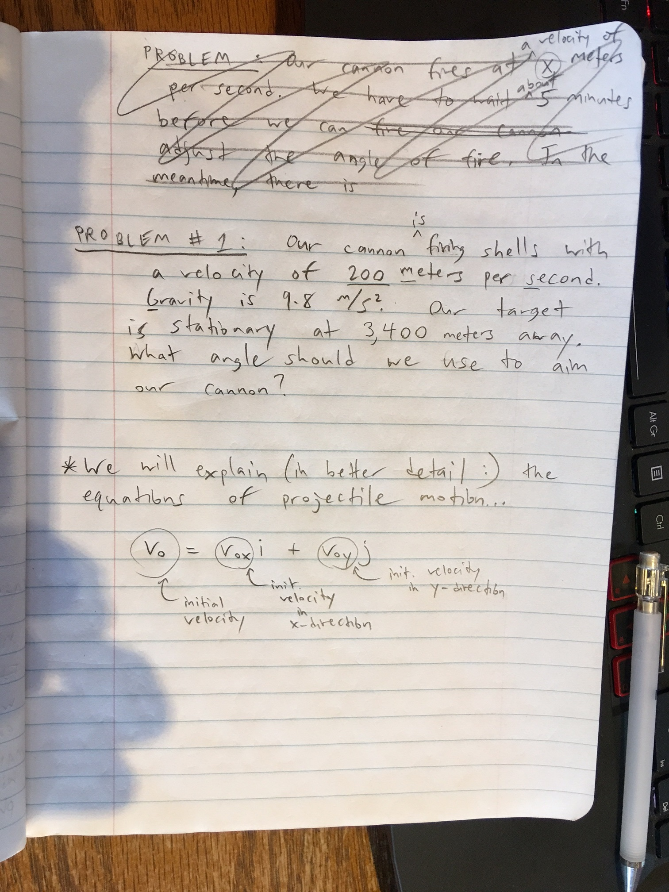

## Newtonium
Welcome to my Release Notes page for Project Newtonium!  Newtonium is the working title of a physics learning game to be developed in Unity.  The target audience of this project is high school to college level students who are either interested in, or required to take an introductory pre-engineering physics course.  The goal of this project is to act as either a spark or a catalyst for interest in classical mechanics (applications of newton's laws and other topics) through the use of some traditional video game elements including a dialogue-driven story, animated graphics, and music.

 
## *Latest Update: March 15, 2017*

  

Really small update this time, I took a spring break vacation and also got sick, tough couple of weeks for project Newtonia.  Looking to bounce back with a considerably bigger update in the middle of April!
 
The short animation above is a quick one I did for a fellow soldier that Main runs into that tells him the base is under attack.  This is part of the inciting incident (the base being under attack :) that sets the stage for Main jumping into a cannon for the physics problem.  The animation is clearly very basic and not one that I would want to use for a final version, but from now till the end of the semester this will probably be the level of animation I use for the working version of the game, where it is just to give an idea of how the story is to be told and also to serve as a draft of a finalized animation.
 
An issue I am having now is getting my dialogue text manager to handle different dialogue sequences in the game.  As a continuation of the previous update, I am trying to get the soldier above to begin talking to Main when Main walks nearby him.  While I was able to do this, I am having difficulty getting the dialogue to appear after the inital dialogue shown in the previous update.

### Goals for the next month:
I need to further develop the interactive dialogue boxes into the game, which will be the basis for both communicating the story and instructing players on how to play the game.  I need to get a simple dialogue-based problem in the game, while also starting on the structure for the presentation of the actual level/problem presentation, with rough shapes/very quickly done graphics acting as fill-ins for what will later be finalized game graphics.

### Previous Updates: 
#### *March 15, 2017*

  

Dialogue box structure for telling the story and coordinating the game is now up and semi-functional; functional in that you can go to the next page of text by hitting enter, the box dissapears after all text for a given dialogue has ended, and the graphical appearance of the boxes are more or less finalized.  Non-functional in that I have not been able to get the dialogue boxes to trigger (appear) in the way they need to be incorporated in the game.  I had issues where I was using physics collision detection to make the box appear when a character gets within range of the main character, but it made that character physically push the main character while talking to him, which obviously is not good!  I believe this can be fixed well before the next update though.
 
Comparing this update's screencast gif with last week's, you'll notice a pretty big change (hopefully :), as along with the finalized appearance of the dialogue box, there now is a basic background with clouds and simple mountains present.  The cloud sprites I had already drawn about a month ago while I was prepping much of the graphics, while the mountains are simple triangle shapes that would be detailed or even changed completely for a final game release.
 
What I am very happy with is the inclusion of parallax scrolling with these backgrounds!  Parallax scrolling is an old-school 2-D graphics technique used to create depth perception between the foreground and background.  It works by having objects (images) that are supposed to be further in the distance scroll by at a slower rate than objects in the foreground, as the main character walks from left to right.  Big thanks to the YouTube [tutorial video](https://www.youtube.com/watch?annotation_id=annotation_787378253&feature=iv&src_vid=9bhkH7mtFNE&v=QkisHNmcK7Y#t=2.603893) from which I learned how to code the script that can achieve parallax scrolling in Unity!

#### *March 1, 2017*

  

Following up on the status of the walk animation from the last update, I made the walk animation "flip" when the player goes from moving left to moving right, so his walking animation is in the left or right direction as appropriate instead of just walking to the left all the time.  He also animates consistently on command, an issue I had at the end of the last update.
 
I cleaned up the helicpoter spin animation of CASCopter and imported the sprites into Unity.  I got CASCopter to follow Main in a trailing manner, and also "flip" his animation when he moves in a different direction.  These seemingly simple tasks took me a fair amount of time, as I needed to create and tweak two scripts to get CASCopter's following behavior to work as I wanted it to.  In fact it is not quite how I want it yet, as I would like CASCopter to hover slightly up and down with his animation as he follows Main, but it was taking too long so I'm putting that on hold for now.
 
I began the process of implementing dialogue boxes.  The Hello Worldish box is fitting in that I have currently only achieved the most basic level of dialogue/complexity, but it's a start.  Interactive dialogue boxes will be a focus of the next update.

#### *February 15, 2017*

  

I completed the walk cycle animation and imported it into Unity.  I wrote a simple script to control the protagonist (who I will refer to as "Main" from this point on as his working name).  At the moment the script simply supports left and right movement, while the walk animation is not coordinated to only activate while Main is standing still.  I will fix this for the next update, as well as fix the animation to "flip" depending on if the player is moving left or right.  I created a simple floor graphic with collision detection, which is demonstrated above as Main walks off a cliff, but this is more of a demo and not indicative of where the actual gameplay is headed.  I created some additional graphics as well, which can be seen for now in my sprites folder, but upon my meeting with my project advisor I will be focusing mostly on scripts to structure player and game behavior, and trying to incorporate new graphics simply as needed and for functional purposes rather than going straight for a "finished product look".

#### *February 1, 2017*

  

I have nearly completed the walk cycle animation for the protagonist of the game.  I wanted to be finished with this task by now, I think that my OCD tendencies with visual stuff is getting the better of me here, but I believe this task will be completed within a week, and the controllable sprite animation will be imported into a very basic test stage (simply the character on a plain background that can be controlled).  Not coincidentally, there is a meeting scheduled with our instructor and advisor for this independent study project in a week's time, and thus I am shooting for the above and more to be posted here for the next relase notes update.
 

#### *January 16, 2017*
One week into a 15-week period of time allotted to this project, the focus has been largely on the planning of how to best use the remaining 14 weeks towards completion of the project.  I have skimmed through a number of courses on [Udemy](https://www.udemy.com/courses/) and YouTube that feature Unity development related to this project, and while it appears that I cannot yet accurately finalize which courses will be the best to focus on, I am fairly confident that [this course](https://www.udemy.com/unity2dplatformer/) and [this video series](https://www.youtube.com/results?search_query=unity+rpg+tutorial+gamesplusjames) will teach me techniques that I can use in a similar fashion for the implementation of my game.  Specifically, the animation and manipulation of 2D sprite-based characters for the first series, and the use of dialogue boxes involving multiple characters from the second instructional video set.

*Storyboards*
 

  
  
  

Pictured above are storyboards for the introduction to the game.  Eventually I would like to have a title screen and possibly an additional introductory screen or two, but this is the main part of the introduction of our main character and the story he partakes in that motivates the solving of physics problems.  The working plot summary is that Main, our protagonist, lives in a fictional universe where he is part of a military academy.  Immediately the military base he occupies is under attack, and he is introduced to the first of many situations where he must use physics to get through his dilemma.  The idea for the story following this introductory level, is that Main's world will have been changed drastically following this sudden outbreak of war, and the new world is ravaged and full of people in need and being oppressed by the militia that remains after the fallout.  Main and his sidekick Cascopter decide that they will not harm anyone in this new world, and will instead use their abilities with physics to save as many people as they can.

