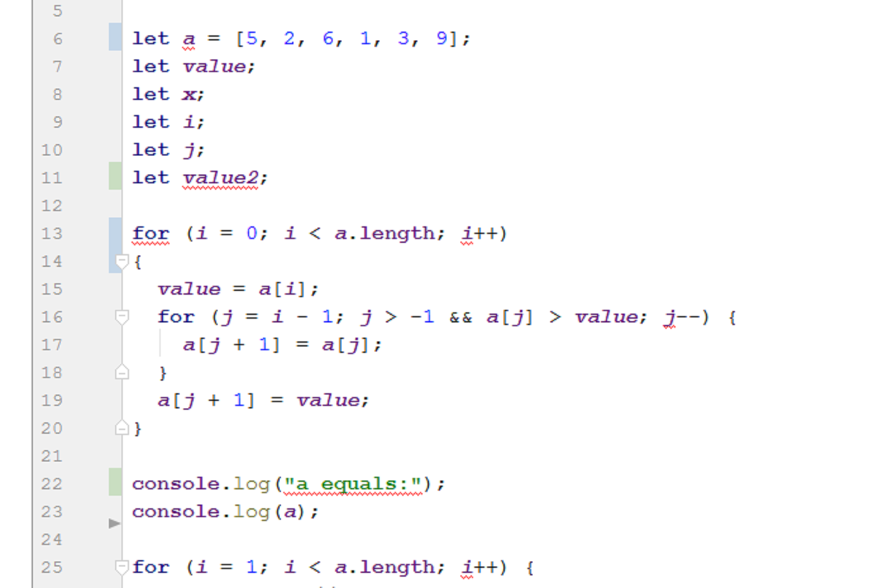

As an aspiring computer scientist who has very limited experience with web application development, let alone web app frameworks, the idea of [Meteor](https://www.meteor.com/) held strong appeal: a way to build professional grade web applications for both home computer and mobile devices, all with once language (JavaScript).  I had some exposure to Meteor in the past but never fully invested myself in it until recently, and I was excited to begin a journey towards making a cool web application with my own semi-unique idea behind it all.  Now?  Those dreams have been crushed, along with my soul.  Kidding, but I did indeed get a tough reality check upon realizing that while Meteor may be a faster, possibly better way than most for build a web app *full stack* (from the user interface/client side front end, to the server side back end), it's not a miracle of immediate ease of use and productivity.

I did feel at times like I was searching for a unicorn while trying to understand how the code worked in [some of the  Meteor tutorials](http://courses.ics.hawaii.edu/ics314f16/morea/meteor-1/experience-meteor-blaze-tutorial.html) I was exposed to.

## Lint Is Useful!

*Those colored squiggly lines mean I have errors?  All I see is blonde, brunette, redhead...*

This week in software engineering marked the first time we used the IntelliJ IDE, and along with it we used a popular quality assurance tool for maintaining a coding standard in JavaScript, in ESLint.  [Installing ESLint for IntelliJ](http://courses.ics.hawaii.edu/ics314f16/morea/coding-standards/experience-install-eslint.html) kind of blew my mind, but thankfully utilizing it proved to be not as difficult.  ESLint shows coding standard errors by underlining your code in a way similar to how Microsoft Word marks grammatical or spelling errors, via red squiggly underlines.

*All that red?  Really?*

It takes a little while to get used to your code looking like an English paper rough draft that got the extreme red marker treatment, but if you keep in mind that your code will usually look that way until you finish your program, ESLint seems like a great tool to remind you of how to maintain the JS code standard.  I would like it if there existed an autocorrect feature for cases where the code would execute the same way regardless, e.g. things like using single quotes instead of double quotes for all JavaScript strings.

## Good Thing Billy Knows How To Type Now, His Handwriting Sucks

Although maintaining coding standards may never light my world on fire regardless of how sophisticated the tools for doing so become, it helps when I keep in mind that maintaining a standard ensures a project team of programmers will have a degree of conformity when it comes to looking at other people's code, and writing code that others can more easily interpret.  It is perhaps likely that given a large group of programmers, someone will have a personal coding style that is difficult for another team member to decipher.  Having a coding standard can only help to alleviate such situations.
