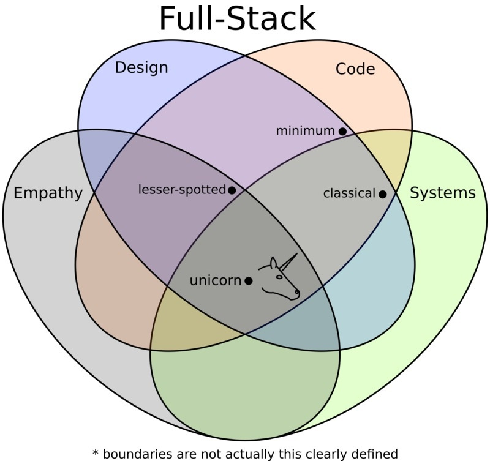

As an aspiring computer scientist who has very limited experience with web application development, let alone web app frameworks, the idea of [Meteor](https://www.meteor.com/) held strong appeal: a way to build professional grade web applications for both home computer and mobile devices, all with one language (JavaScript).  I had some exposure to Meteor in the past but never fully invested myself in it until recently, and I was excited to begin a journey towards making a cool web application with my own semi-unique idea behind it all.  Now?  Those dreams have been crushed, along with my soul.  Kidding, but I did indeed get a tough reality check upon realizing that while Meteor may be a faster, possibly better way than most for build a web app *full stack* (from the user interface/client side front end, to the server side back end), it's not a miracle of immediate ease of use and productivity.

I did feel at times like I was searching for a unicorn while trying to understand how the code worked in [some of the  Meteor tutorials](http://courses.ics.hawaii.edu/ics314f16/morea/meteor-1/experience-meteor-blaze-tutorial.html) I was exposed to.  It turned out, certainly in my case, that Meteor has a pretty steep learning curve.

## Directories, Directories Everywhere

There are a lot of programming structure in Meteor that in practice were a bit shell-shocking to encounter all at once, despite how in theory, it makes sound sense: JavaScript handles all of the "database stuff", and other programming logic, which HTML refers to when it needs to through the use of templates.  Templates are referenced in HTML through a seemingly easy-enough syntax called [SpaceBars](http://blazejs.org/guide/spacebars.html), and taken separately, each "piece" of Meteor does seem very comprehendable.  My big issue was that seemingly many, many new pieces are introduced (and necessary) all at once in order to make something that actually works in Meteor.  In particular, the current best practice of separating code into many different subdirectories with import statements needed to connect them all, threw me for a loop.

## It's a Big First Step

After two week of getting hit by Meteor, it is starting to feel more (although not yet) comfortable.  Simply plowing forward and fooling around with tutorial code to see what happens when you change this or that, has led to personal progress.  In particular, [this tutorial](http://meteortips.com/first-meteor-tutorial/) was very helpful all putting all of the pieces together, despite being written with an earlier version of Meteor in mind.  I now believe that it will be a fair amount of time before I can put my own web app dreams into full gear, but it is a small victory that within a couple weeks, what once seemed possibly insurmountable now seems difficult, yet possible. 
