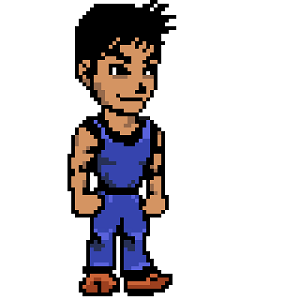

  
  

Sword Run is the working title of a 2D action/adventure game project.  The project is intended to be released on the Android and iOS platforms.

Sword Run is being developed with [Unity3D](https://unity3d.com/), a popular game development environment used for both mobile and desktop game applications.  The 2D sprites used for most of the graphics are currently being developed in [Piskel](http://www.piskelapp.com/).  The game will feature two-touch gameplay for control of your player's attack and evasive movements.
