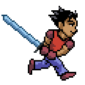
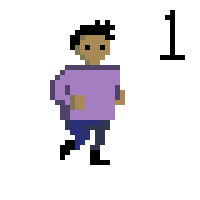
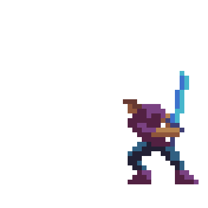

  
  
  

Sword Run is the working title of a 2D action/adventure game project.  The project is intended to be released on the Android and iOS platforms.

Sword Run is being developed with [Unity3D](https://unity3d.com/), a popular game development environment used for both mobile and desktop game applications.  The 2D sprites used for most of the graphics are currently being developed in [Piskel](http://www.piskelapp.com/) and [Aseprite](http://www.aseprite.org/).  The game will feature multi-touch gameplay for control of your player's attack and evasive movements.

Pictured above are conceptual sprite work and animation.  The first animation is a near complete run cycle animation that will be used in the final game.  The second run cycle animation was an exercise to learn how to create a basic running animation as a foundation to work on animating the more detailed main character.  The third animation was another exercise done to practice drawing and animating a sword attack.  Learning how to create sprites in Piskel and Aseprite, and control them in a game environment, is an ongoing process made possible through following courses on [Udemy](https://www.udemy.com).
