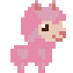
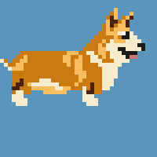

  
  
  

Pet Princess is the working title of a game currently in the planning stage.  The appeal of the game centers on combining cute pet animals with fitness tracking and augmented reality.  I got the idea for this game from observing the interests of other individuals that varied greatly from my own.

Inspired in part by Pokemon Go, Pet Princess will initially give users access to a single virtual pet.  Through caring for the pet by means of walks or runs monitored via mobile device, users will unlock changes made available for their pet, such as changing their color or appearance.  Augmented reality becomes a factor when you take your pets to specific types of landmarks, such as the beach, parks, hiking trails, etc.  New pets can also be unlocked through amassing enough of these care points.

Pictured above are conceptual pixel art for a pet owner avatar and two possible pets to control.
