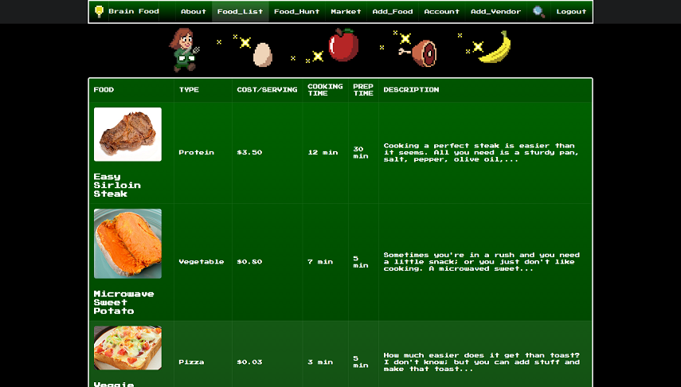
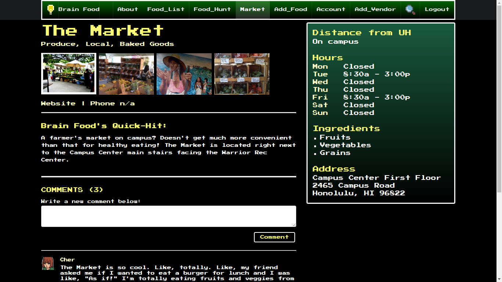

<a href="https://brain-food.github.io/">Brain Food</a> is a web application aimed at giving students nutrition ideas for the purpose of better brainpower.  Quality nutrition is a key component for cognitive performance, yet is something easily overlooked by college students who are living independently and often strapped for both time and money.  By offering a growing database of both healthy recipe ideas and locations where ingredients and meals can be purchased, Brain Food gives students a resource for improving their quality of nutrition.

This was our final project for an introductory Software Engineering course at the University of Manoa.  I worked on the application's video game sprite-inspired graphics and the general site design.  I also was able to create a working comment function for users to add comments regarding a particular food location, using Meteor's MongoDB database format.  This was made possible through the Meteor lessons provided to us in the course, and also with a lot of assistance from my teammate Kea Uehara.  It was an excellent experience working with both Kea and my other teammates Steven Braun and Riley Miyamoto, who all contributed a ton to this project and made it possible.  As of December 2016 the project is not yet complete in regards to being ready for a public release, but many features are working properly including CRUD functionality for recipe documents (database records in MongoDB).

We needed to utilize many of the concepts and skills learned earlier in the semester, as well as learn new techniques to implement Brain Food.  We created Brain Food with the use of Meteor (coded in JavaScript and HTML/CSS), Semantic UI (a CSS framework), and I worked on the site graphics using Piskel, Aseprite, and MS Paint.  Some of the course concepts we followed throughout production included functional programming, UI design for web-based software, and team-based project management.  Perhaps needless to say, it was a rigorous process but also one I thoroughly enjoyed, and was fortunate to have the opportunity to partake in.
